# 🎓 Proyecto: CRUD de Estudiantes y Carreras

Este proyecto consiste en el desarrollo de un **sistema CRUD (Create, Read, Update, Delete)** utilizando **Laravel** y **Tailwind CSS**.  
El objetivo es aplicar los conocimientos sobre **arquitectura MVC**, manejo de base de datos, validaciones y creación de interfaces funcionales para gestionar estudiantes y carreras en un sistema educativo.

---

## 📖 Descripción general

### 🧩 Vista previa del proyecto

Agrega aquí capturas de pantalla de tu sistema funcionando.

### Estudiantes
Lista de Estudiantes
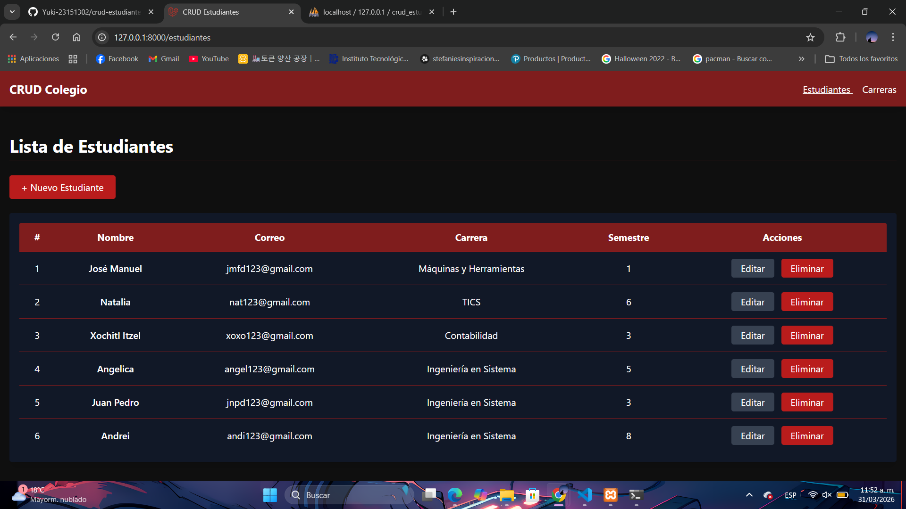!

Registrar Estudiante
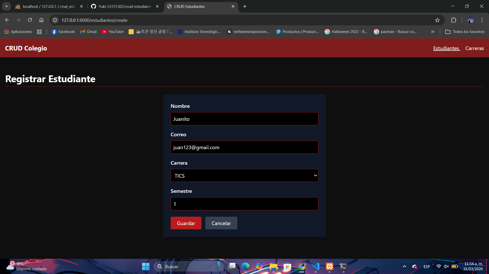 

Estudiante Registrado
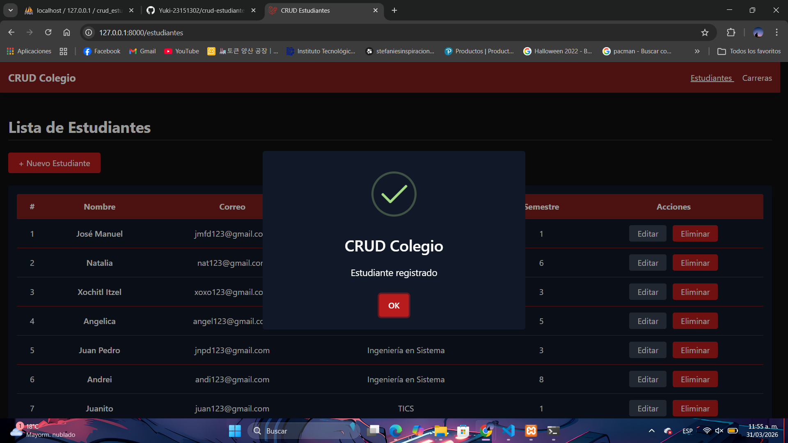  

Editar Estudiante
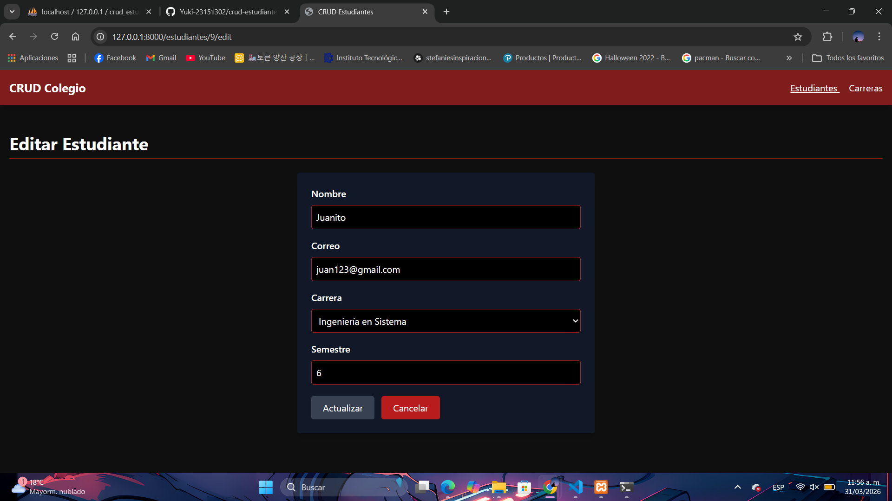  

Estudiante Actualizado
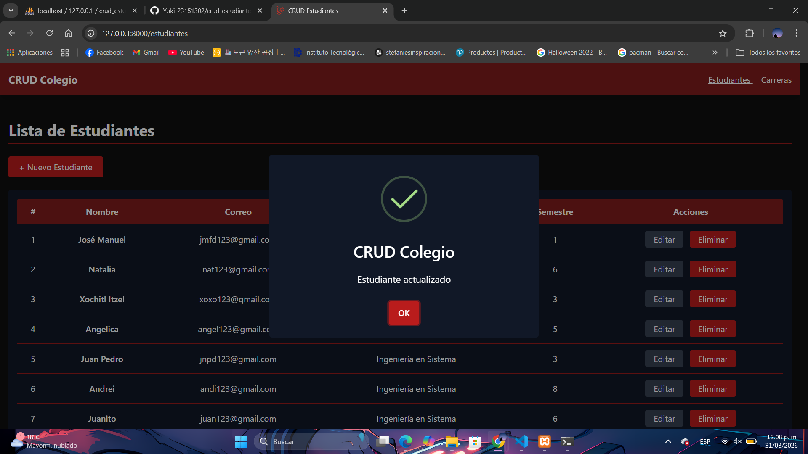

Confirmación de Eliminar Estudiante
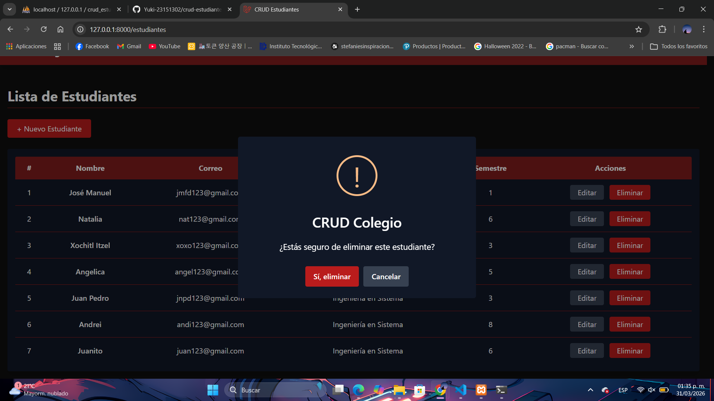

Estudiante Eliminado
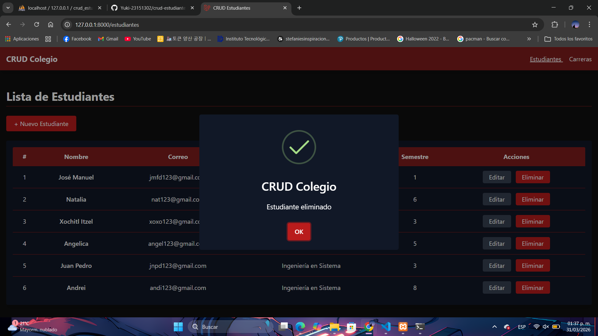 

### Carreras
Lista de Carreras
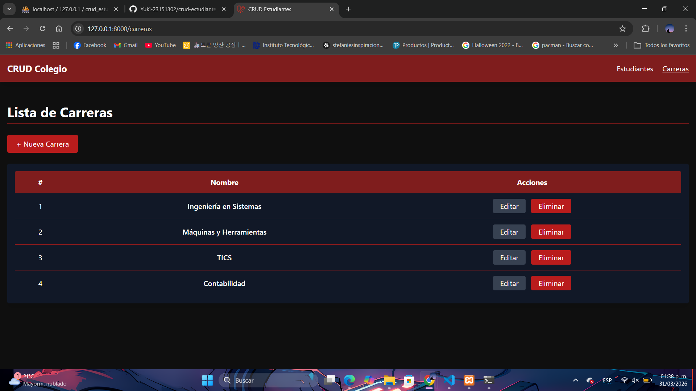

Registrar Carrera
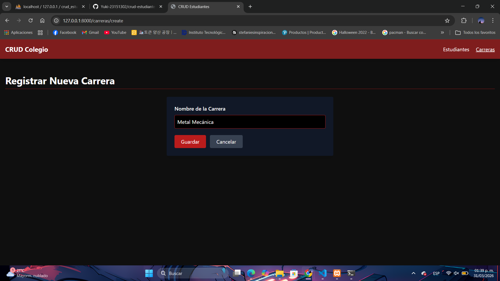 

Carrera Registrada
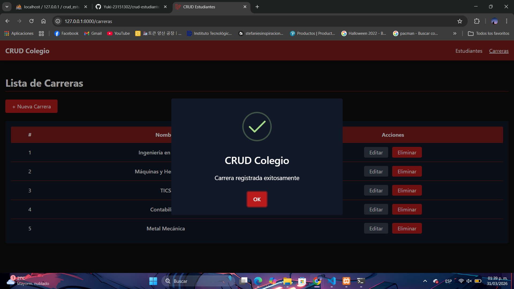 

Editar Carrera
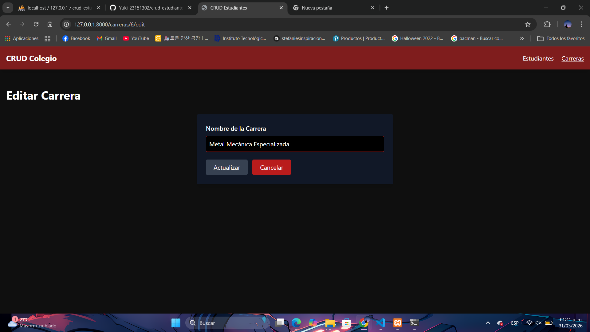  

Carrera Actualizada
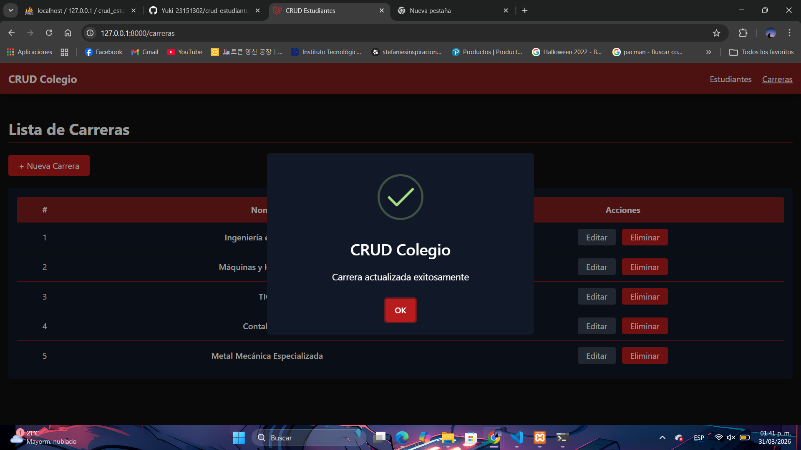 

Confirmación de Eliminar Carrera
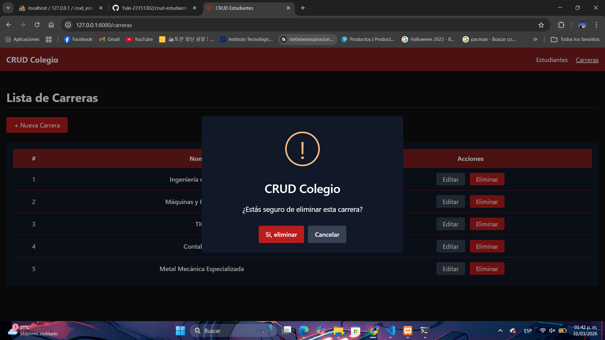

Carrera Eliminada
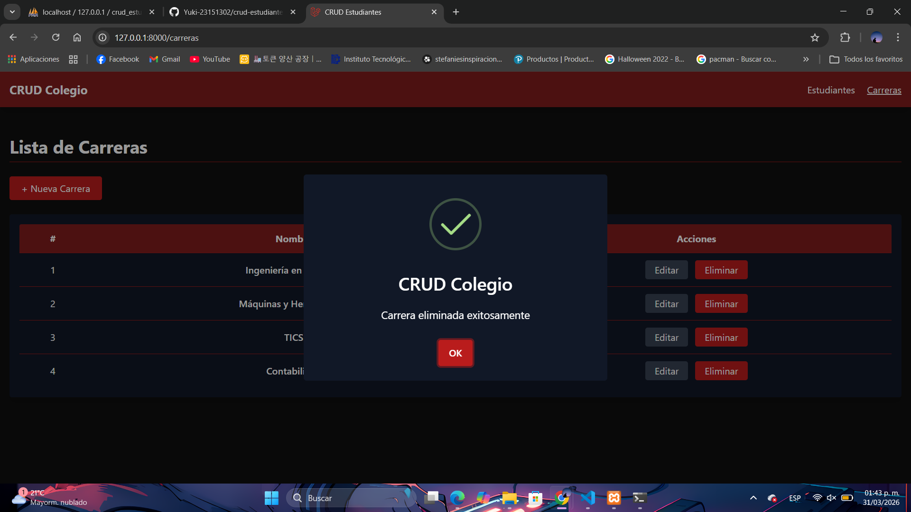 

---

### 🔗 Enlaces del proyecto

* **Repositorio en GitHub:** [[Repositorio en GitHub](https://github.com/Yuki-23151302/crud-estudiantes.git)]

---

## 🧠 Proceso de desarrollo

### 🛠️ Tecnologías utilizadas

* Laravel 12  
* PHP 8.2  
* MySQL (XAMPP)  
* Tailwind CSS  
* Blade (motor de plantillas)  
* HTML5  

---

## ⚙️ Funcionamiento del sistema

El sistema permite gestionar **Estudiantes** y **Carreras** mediante las operaciones CRUD.

### 🟢 Crear (Create)

**Estudiantes:**  
Formulario para registrar:  
* Nombre  
* Correo electrónico  
* Carrera  
* Semestre  

**Carreras:**  
Formulario para registrar:  
* Nombre  

> Ambos formularios validan los datos antes de guardarlos en la base de datos y muestran mensajes de éxito:  
> - “Estudiante registrado exitosamente”  
> - “Carrera registrada exitosamente”

---

### 📋 Leer (Read)

**Estudiantes:**  
Se muestra una tabla con todos los estudiantes registrados:  
* Número (numeración visual)  
* Nombre  
* Correo  
* Carrera  
* Semestre  

**Carreras:**  
Se muestra una tabla con todas las carreras registradas:  
* Número  
* Nombre  

---

### ✏️ Actualizar (Update)

Se pueden editar los datos de estudiantes y carreras desde un formulario:  
* Se cargan los datos actuales  
* Se pueden modificar  
* Al guardar, se muestran mensajes de éxito:  
> - “Estudiante actualizado exitosamente”  
> - “Carrera actualizada exitosamente”

---

### ❌ Eliminar (Delete)

Se pueden eliminar registros desde la tabla:  
* Se elimina el registro seleccionado  
* Se muestran mensajes de éxito:  
> - “Estudiante eliminado exitosamente”  
> - “Carrera eliminada exitosamente”  

---

## ⚠️ Nota importante sobre numeración visual

La numeración en las tablas es **visual y dinámica**:

* ✔ Se muestra consecutivamente (1, 2, 3…)  
* ✔ Se actualiza al eliminar registros  
* ❌ No corresponde al ID real en la base de datos  

El ID original **no se modifica**, ya que es la clave primaria y asegura la integridad de los datos.

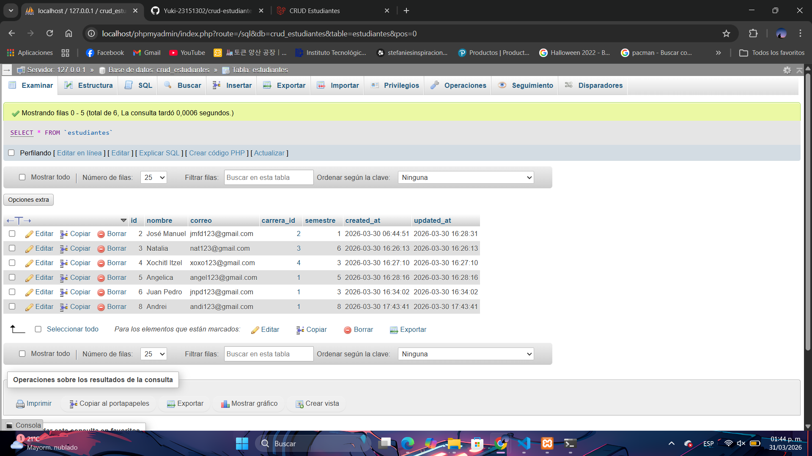
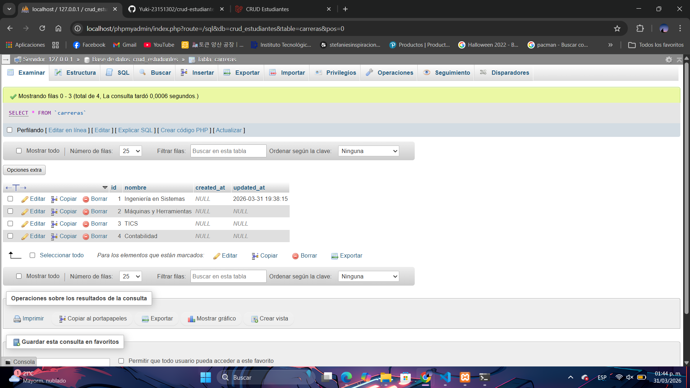

---

## 🧱 Estructura del proyecto

```bash
crud-estudiantes/
│
├── app/
│   ├── Models/
│   │   ├── Estudiante.php
│   │   └── Carrera.php
│   │
│   └── Http/
│       └── Controllers/
│           ├── EstudianteController.php
│           └── CarreraController.php
│
├── database/
│   └── migrations/
│       ├── create_carreras_table.php
│       └── create_estudiantes_table.php
│
├── resources/
│   └── views/
│       ├── layouts/
│       │   └── app.blade.php
│       │
│       ├── estudiantes/
│       │   ├── index.blade.php
│       │   ├── create.blade.php
│       │   └── edit.blade.php
│       │
│       └── carreras/
│           ├── index.blade.php
│           ├── create.blade.php
│           └── edit.blade.php
│
├── routes/
│   └── web.php
│
└── .env
```

---

## 🧠 Lo que aprendí

Durante el desarrollo de este proyecto reforcé mis conocimientos sobre el uso del framework Laravel y su arquitectura MVC. Aprendí a conectar modelos con la base de datos, crear controladores para manejar la lógica del sistema y desarrollar vistas dinámicas con Blade.

También practiqué la implementación de relaciones entre tablas, en este caso entre estudiantes y carreras, lo cual me permitió comprender mejor cómo funcionan las llaves foráneas en bases de datos.

Además, trabajé con Tailwind CSS para diseñar una interfaz moderna y consistente, utilizando una paleta de colores basada en tonos rojos, negros y grises.

---

## 🚀 Áreas de mejora

Algunos aspectos que podrían mejorarse en futuros proyectos son:

* Paginación en las tablas
* Buscador y filtros para registros
* Mejorar la validación con mensajes personalizados
* Implementar autenticación de usuarios
* Mejorar la experiencia del usuario con animaciones

---

## 📚 Recursos útiles

Durante el desarrollo del proyecto se consultaron diversas documentaciones y recursos:

* [Documentación oficial de Laravel](https://laravel.com/docs)
* [Tailwind CSS](https://tailwindcss.com/docs)
* [MDN Web Docs](https://developer.mozilla.org/es/)

---

## 👩‍💻 Autor

* Nombre completo: Elvia Yuridia Flores Dueñas
* Carrera: TICS
* Grupo: --
* Correo institucional: [23151302@aguascalientes.tecnm.mx](mailto:23151302@aguascalientes.tecnm.mx)

---

## ✨ Reflexión final

Este proyecto me permitió comprender de manera más clara el funcionamiento completo de un sistema CRUD utilizando Laravel. A diferencia de proyectos más simples de maquetación, aquí pude trabajar tanto en la lógica del backend como en la interfaz del usuario.

Una de las partes más interesantes fue la conexión entre el controlador, los modelos y las vistas, ya que pude ver cómo fluye la información dentro de la aplicación. También disfruté trabajar con Tailwind CSS para darle un diseño más atractivo al sistema.

En general, este proyecto fortaleció mis habilidades en desarrollo web y me dio una mejor comprensión del funcionamiento de aplicaciones dinámicas conectadas a una base de datos.
